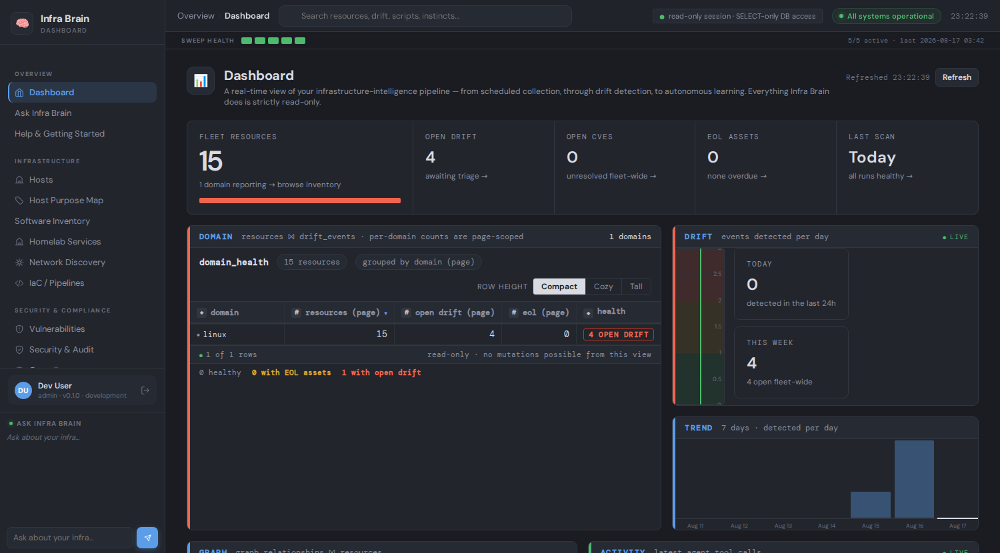

# Infra Brain

**A read-only infrastructure knowledge platform.** Pluggable collectors sweep
infrastructure sources on independent schedules and land everything in
PostgreSQL; a bitemporal knowledge graph is derived declaratively from that
data (nodes and edges a collector *declares*, not a hand-written deriver
layer); drift detection, compliance, remediation, and a chat agent then
operate on top of the graph. Built on LangChain + LangGraph + FastAPI +
PostgreSQL + Redis, with a Vite+React dashboard.

> **About this repository.** This is a sanitized, curated copy of a longer-running
> personal project, published as a portfolio piece. Internal deployment
> specifics (real hostnames, IPs, an internal GitLab instance, and the
> operator's own network) have been replaced with placeholder values
> throughout. The project's day-to-day findings log, session handoff notes,
> and an embedded ops-tooling plugin tied to the origin deployment's real
> fleet were intentionally not carried over — what's here is the product
> itself: the agent framework, the graph engine, the dashboard, the test
> suite, and the AI-native engineering tooling (`.claude/`) used to build it.



## Read-Only Guarantee

Infra Brain **never mutates the infrastructure it observes**. Read-only is
enforced in three independent layers (see [`docs/READONLY-MODEL.md`](docs/READONLY-MODEL.md)):

1. **Structural** — collectors hold GET-only HTTP clients; the SQL agent uses a SELECT-only DB role.
2. **Boundary gate** — every tool call is checked pre-execution by a safety callback, and every
   sanctioned external write (a GitLab MR, a ticket, a doc-page update) passes a separate write gate.
3. **Audit** — the full callback chain (`AuditCallbackHandler → ReadOnlyToolValidator →
   DLPCallbackHandler → ObservationCallbackHandler`) records every call.

Its only permitted write paths are its own PostgreSQL database, and a small
set of explicitly-gated, human-approved external proposals (a merge request,
a ticket) — never a direct change to the systems it watches.

---

## Architecture

```
┌──────────────────────────────────────────────────────────────┐
│                       TRIGGER LAYER                          │
│  APScheduler (per-domain cron)     FastAPI webhooks           │
└────────────────┬─────────────────────────┬───────────────────┘
                 ▼                         ▼
┌──────────────────────────────────────────────────────────────┐
│      AgentSpec REGISTRY  (etl/spec.py — one declaration       │
│      per domain: tier · schedule · staleness · graph          │
│      contract — emits_nodes / emits_edges / identity_keys)    │
└────────────────┬─────────────────────────────────────────────┘
                 ▼
┌──────────────────────────────────────────────────────────────┐
│   SWEEP ORCHESTRATION — typed dispatch (default) or an        │
│   opt-in LangGraph StateGraph with Send fan-out + Postgres    │
│   checkpointing                                                │
└──┬───────────────────────┬───────────────────────┬───────────┘
   ▼  TIER 1: COLLECTOR     ▼  TIER 2: RECONCILER    ▼ TIER 3: REASONER
 dozens of domain          host identity            RootCause (LLM*)
 collectors, independently resolution, graph          ComplianceGapFinder*
 enable/disable-able        maintenance                DriftLearning
 (see AgentSpec.retired)                               Remediation interrupt*
                 │                                     (* flags default-off)
                 ▼ Resource rows → Postgres
┌──────────────────────────────────────────────────────────────┐
│         DECLARATIVE GRAPH ENGINE  (graph_engine.py)           │
│  Domain-ignorant by construction (guarded by an AST test —    │
│  no collector imports, no domain branching). Reads each       │
│  collector's own NodeSpec/EdgeSpec declarations and            │
│  materializes graph_nodes / graph_edges: bitemporal            │
│  (valid_from/valid_to), authority-tracked (auto vs human,      │
│  a human veto can never be overridden by a machine claim).     │
└────────────────┬───────────────────────────────────────────────┘
                 ▼
┌──────────────────────────────────────────────────────────────┐
│              SAFETY CALLBACK LAYER                            │
│  ReadOnlyToolValidator · DLPCallbackHandler                   │
│  AuditCallbackHandler  · ObservationCallbackHandler            │
└──────────────────────────────────────────────────────────────┘
                 │ (drift detected)
                 ▼
┌──────────────────────────────────────────────────────────────┐
│         NOTIFICATION · CHAT · LLM OBSERVABILITY                │
│  Ticket/doc-page proposals on drift · a streaming chat agent   │
│  that walks the knowledge graph, identity-aware (two sightings │
│  of the same host, linked by SAME_AS, answer as one machine)   │
│  · a dashboard page auditing every LLM run: tokens, tool        │
│  loops, termination outcome, per-iteration reasoning trace      │
└──────────────────────────────────────────────────────────────┘
                 │
                 ▼ (weekly)
┌──────────────────────────────────────────────────────────────┐
│         CLOSED SELF-IMPROVEMENT LOOP                          │
│  DriftLearningAgent → GeneratedScript → learning.build_context │
│  Instincts · Observations · AgentDecisionLog                   │
└──────────────────────────────────────────────────────────────┘
```

**One declaration, one graph.** Every collector declares what it emits —
nodes from its own resource rows, edges keyed off its own natural keys — in
its `AgentSpec`. A single generic engine (`graph_engine.py`) reads every
declaration and materializes the graph; it has never imported a domain
module, enforced by an AST guard test that would fail the build if it ever
did. Adding a new source's relationships to the graph is a declaration, not
a new deriver.

**Identity is a first-class, authority-tracked claim.** Two different
collectors seeing the same physical host produce two nodes; a resolver links
them with a `SAME_AS` edge carrying a method, a confidence, and an
*authority* (`auto` or `human`). A human `NOT_SAME_AS` veto can never be
overridden by a machine's transitive guess — traversal, identity merging,
and the review queue all enforce that rule at the same choke point.

**Pluggable by design.** Domains are declared once (`etl/spec.py`) and can be
individually retired (`AgentSpec.retired`) or revived without touching the
engine, the graph, or the dashboard. This repo ships with several domains
quarantined by default (enterprise-tooling connectors with no credentials
configured in the origin deployment) — a live demonstration of the pattern:
a hidden collector's UI surface disappears cleanly, and a revived one needs
only credentials, not new code.

**Reasoner-tier LLM features are opt-in**, each behind its own flag defaulting
off (`rootcause_llm_enabled`, `compliance_gap_finder_enabled`,
`remediation_interrupt_enabled`), so the deterministic collection/reconciliation
path never depends on a model being configured.

---

## Features

- **Pluggable collector registry:** every domain declared once in `AgentSpec`
  (`etl/spec.py`) — tier, schedule, staleness window, and its graph contract.
  Individually retire/revive a domain with no engine changes.
- **Declarative knowledge graph:** bitemporal `graph_nodes`/`graph_edges`,
  materialized by one domain-ignorant engine from per-collector declarations —
  no hand-written derivation layer, no per-relationship glue code.
- **Identity resolution with a real authority model:** deterministic and
  probabilistic host-identity matching, a human-review queue for ambiguous
  pairs, and a veto that a machine can never silently overrule.
- **Streaming chat agent** over the knowledge graph and the collected data —
  identity-aware (answers for a host as one entity even when two collectors
  see it under different names), with per-answer provenance and a bounded,
  auditable ReAct loop.
- **LLM observability dashboard:** every model-driven run's iteration ladder —
  tokens per call, tools invoked, loop detection, and whether it concluded or
  hit its budget — auditable from the UI, not just the logs.
- **Real-time drift detection:** structured diff of consecutive snapshots,
  with configurable noise suppression for event-shaped (vs. durable) resources.
- **Hybrid RAG knowledge store:** pgvector cosine similarity fused with
  Postgres full-text search via Reciprocal Rank Fusion, gated behind
  `rag_enabled` (default off).
- **Self-improvement loop:** Instinct promotion, Observation recording,
  GeneratedScript persistence, a weekly DriftLearningAgent pass.
- **Closed-loop remediation & analysis:** inventory reconciliation, proposed
  remediation actions with an approval gate, vulnerability triage, policy
  compliance checks, root-cause correlation across the graph.
- **A real safety chain, not a policy document:** every tool call passes
  through the same callback chain; DLP scans for cardholder-data-shaped
  strings without corrupting UUIDs that happen to be Luhn-valid; every call
  is audited.
- **Web dashboard** (Vite+React, served by the FastAPI app at `/dashboard2`;
  `/` redirects there): resource inventory, drift, vulnerabilities, EOL,
  the knowledge graph explorer, chat, LLM observability, a derived settings
  catalog (every value labeled by its source — env, database override, or
  default), collection runs, notifications, remediation, and more. Session-
  cookie auth over a `ui_users` table.
- **Bitwarden Secrets Manager integration:** only one bootstrap token is a
  deployment secret; everything else is pulled at startup.
- **Fail-closed security defaults:** DLP scanning, gated webhook auth, an
  integration-approval gate for anything that would write externally.

---

## Repo Layout

```
infra-brain/
├── src/infra_brain/
│   ├── agents/          # Domain collectors/reconcilers/reasoners
│   │   └── llm_base.py  # LLMAgent — base for every LLM-reasoning agent
│   ├── etl/spec.py      # AgentSpec registry — the single source of truth
│   ├── graph_engine.py  # Domain-ignorant graph materialization engine
│   ├── graph_phase2.py  # graph_nodes/graph_edges upsert primitives
│   ├── graph_phase3.py  # Identity resolution, blast-radius/root-cause traversal
│   ├── graph_kg.py       # Read-side knowledge-graph BFS (chat + dashboard)
│   ├── chat/             # LangGraph streaming chat agent + read-only tools
│   ├── tools/            # LangChain tools (read-only connectors)
│   ├── callbacks/        # Safety + observability callback chain
│   ├── db/
│   │   ├── models/       # SQLAlchemy models, split by domain
│   │   ├── session.py
│   │   └── schema_check.py  # startup schema-drift assertion
│   ├── api/
│   │   ├── routers/      # Route handlers by domain
│   │   └── schemas.py    # Pydantic response models
│   ├── config.py         # Pydantic Settings — all configuration
│   ├── main.py           # FastAPI app factory
│   ├── scheduler.py      # APScheduler service
│   └── secrets.py        # Bitwarden bootstrap
├── dashboard-app/         # Vite+React dashboard — source for /dashboard2
├── .claude/               # AI-native engineering tooling: specialist agents,
│                            reusable skills, and hooks used to build this repo
│                            (see .claude/README.md for what's project-specific
│                            vs. a bundled, reusable LangChain toolkit)
├── skills/                # An operating manual for USING the deployed system's
│                            MCP tool surface — distinct from .claude/skills/,
│                            which is tooling for DEVELOPING this repo
├── rules/                 # Policy-as-code (e.g. compliance rule thresholds),
│                            loaded at runtime by ComplianceAgent/RemediationAgent
├── scripts/               # One-off/bootstrap scripts — see scripts/README.md
│                            for which ones you'll actually use
├── docker/                 # docker-compose.yml + Dockerfile (see docker-compose.yml's
│                            header for what the .dev/.deploy/.homelab overlays are)
├── k8s/                    # Kubernetes manifests
├── alembic/                # Database migrations
├── tests/                  # pytest suite
├── docs/                   # See docs/README.md for an index — ARCHITECTURE.md,
│                            READONLY-MODEL.md, MCP_SERVER.md, USER_GUIDE.md, and
│                            PATTERNS.md are the load-bearing references;
│                            decisions/ is the architecture-decision-record archive
├── dev_proxy.py            # Optional local-dev proxy: serves the dashboard's static
│                            files directly while proxying /api/* to a running backend
├── Makefile                # `make setup|test|lint|doctor` — shortcuts for the
│                            commands spelled out below
├── .env.example
└── pyproject.toml
```

---

## Quick Start

```bash
cp .env.example .env
# Edit .env — at minimum set POSTGRES_URL, REDIS_URL, and an LLM provider key

docker compose -f docker/docker-compose.yml up
```

The API is available at `http://localhost:8000`; health check at
`http://localhost:8000/health`. The dashboard is at
`http://localhost:8000/dashboard2` (`/` redirects there). To work on the
frontend directly: `cd dashboard-app && npm ci && npm run dev` (proxies
`/api` to a locally running backend).

### Tests

```bash
.venv/bin/python -m pytest tests/ -q
```

### Linting

```bash
uv sync --extra dev
.venv/bin/python -m ruff check --fix src/ tests/
.venv/bin/python -m ruff format src/ tests/
```

See [`CLAUDE.md`](CLAUDE.md) for the fuller engineering-practice writeup —
the orchestration model, the safety-critical-file table, and the standing
architectural constraints this codebase enforces.
